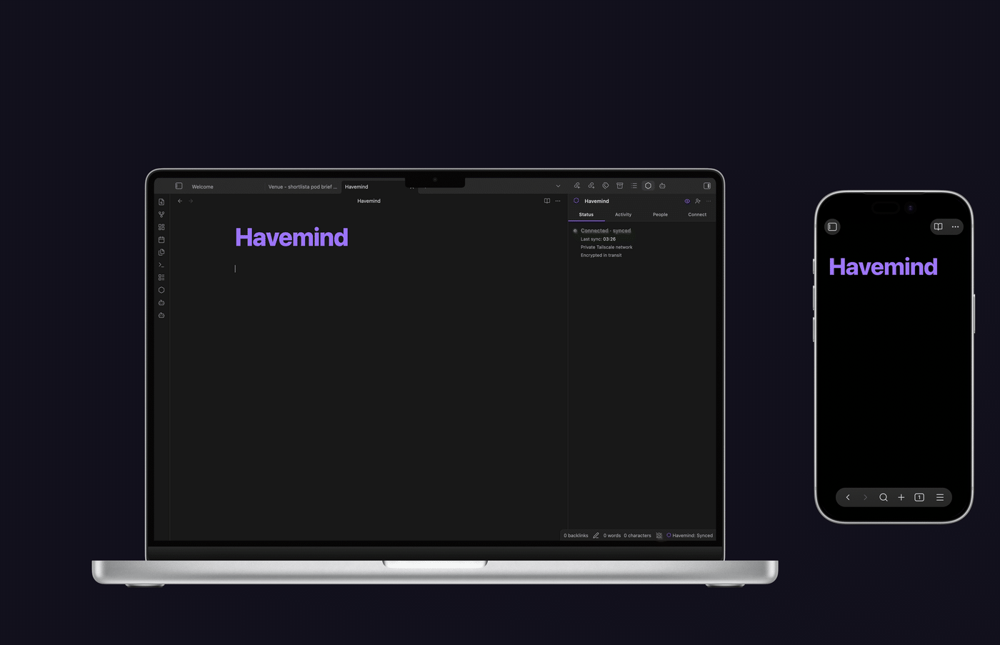
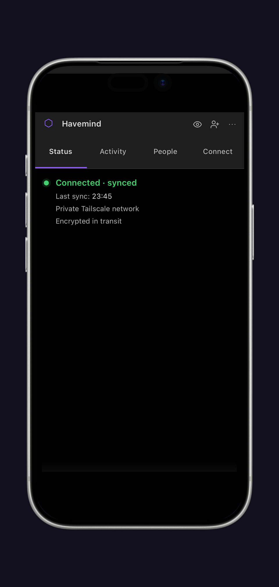

<p align="center">
  
</p>

<p align="center">
  
</p>

# Havemind

### Share one Obsidian vault with people you trust.

Havemind is self-hosted sync for [Obsidian](https://obsidian.md), built for two
or three people sharing one vault. Everyone keeps a normal local copy. A server
you own passes the changes around and remembers who wrote what.

Built for people. If you also run Claude, MCP or another local agent in that
vault, its edits land in the same history.

**Version 1.4.7, desktop and mobile.** A two-week pilot on two devices lost no
data, including through three real incidents.

There is no end-to-end encryption. Your server stores the vault in plaintext,
so whoever runs that machine can read it. Read the
[security model](#security-model) before you connect a vault you care about.

**Self-hosting your own instance?** See
[docs/self-hosting.md](docs/self-hosting.md) for the full zero-to-working
guide (Docker Compose + Tailscale, tailnet-only).

**Connecting Claude or an AI agent?** See
[docs/using-with-ai-agents.md](docs/using-with-ai-agents.md) for the
requirements and the steps.

## Install

Havemind needs two things: the plugin, and a server you run.

**The plugin.** In Obsidian, open Settings, then Community plugins, then
Browse, and search for **Havemind**. Install it and enable it. It runs on
macOS, Windows, Linux, iOS and Android, and needs Obsidian 1.11.4 or newer.

**The server.** There is no Havemind cloud to sign up for: you host it, or you
join someone who does. See [Quick start](#quick-start) below.

## Quick start

Two paths, depending on whether you are the one running the server.

### You are hosting

1. **Install Tailscale** on the machine that will run the server, and log in.
   Everyone who syncs joins the same tailnet; that is the whole access
   boundary, and nothing is exposed to the public internet.
2. **Configure and start the server.** From a checkout of this repository,
   `cp deploy/.env.example deploy/.env` and set `HAVEMIND_API_BASE_URL` to the
   HTTPS tailnet URL you will use in step 3; it is baked into the server's
   discovery document, so it has to be right before the first start. Then
   `docker compose -f deploy/compose.yaml up -d --build`. You need Docker
   Engine with the Compose v2 plugin.
3. **Put Tailscale in front of it** with `tailscale serve`, so the other
   devices on your tailnet can reach it. Full commands are in the
   [self-hosting guide](docs/self-hosting.md).
4. **Create your account.** Run `setup` inside the container, once:

   ```bash
   docker compose -f deploy/compose.yaml exec havemind-server \
     node apps/server/bin/havemind.js setup --owner "Your Name" --vault "My Vault"
   ```

   It prints a single-use pairing token (`hm_pt_...`).
5. **Connect the plugin.** Open the Havemind pane in Obsidian, go to the
   Connect tab, and enter your server's tailnet address
   (`something.tailnet-name.ts.net`) together with that pairing token. The
   Status tab turns green when it is working.
6. **Invite the other person.** People tab, then Invite someone. Send them the
   invitation; it works once.
7. **Approve their device.** They read a 6-digit code aloud to you, you type
   it in. Three attempts. That handshake is what binds their identity, so do
   it by voice, never by message.

The long version, including backups and multiple vaults, is in
[docs/self-hosting.md](docs/self-hosting.md).

### You are joining someone else's vault

1. Install Tailscale, log in, and accept the invitation to their tailnet.
2. Install the Havemind plugin in Obsidian.
3. Open the invitation the owner sent you.
4. Your device shows a **6-digit code**. Read it aloud to the owner over a
   call, never in a chat message.
5. Once they approve, the vault syncs. It appears in your Obsidian like any
   other vault.

## What it does

- **One vault, every device.** Mac, Windows, Linux, iPhone, Android. Write on
  the phone, it is on the laptop a couple of seconds later.
- **Nothing is overwritten silently.** Edits that do not overlap merge on their
  own. When two people change the same lines, both versions survive and a copy
  lands in `Havemind Conflicts/`.
- **You can see who wrote what.** Every change in the Activity panel carries a
  name and a colour, and any revision restores in one click. The author comes
  from the server with the revision, so it is never a guess.
- **Notes, attachments and how the vault looks.** Markdown with line-level
  history, images and PDFs up to 25 MB, plus your theme, snippets, hotkeys and
  graph settings.
- **Joining takes a phone call.** The new device shows six digits, the owner
  types in what they hear. Three tries. That is what ties a person to a device.

<details>
<summary>The details behind those five</summary>

| | |
|---|---|
| Sync speed | A peer's change lands in about a second over the long-poll channel. An edit waits 1.5 s to settle first, so a formatter rewriting the file on save cannot start an edit war. Creates, renames and deletes go out immediately. |
| `.obsidian/` scope | An allowlist, nothing more: `themes/`, `snippets/`, `hotkeys.json`, `graph.json`, `appearance.json`, `app.json`. |
| Attachments | PNG, JPG, GIF, WebP, SVG, PDF, up to 25 MB, byte for byte. |
| Crash safety | The outbox survives a crash. A torn state file is kept as a sidecar and flagged, never dropped. |
| Presence | The owner sees who is connected. A dead session reconnects in one click, no new code. |
| Several vaults | One server, independent vaults. Two teams share a box without seeing each other's data. |
| Backups | Off unless you set `HAVEMIND_BACKUP_DIR`; the shipped compose file sets it. Then a snapshot every 24 h, last 7 kept. Checkpoints are sealed to a public key, so the server that writes one cannot open it. |
| Limits | Storage quota per vault, throttling per device. |

</details>

## What it looks like

<p align="center">
  
</p>

<p align="center">
  
</p>

<p align="center">
  
</p>

## What it will not do

- **Run in our cloud.** There isn't one. The server sits on your hardware,
  reachable only over your [Tailscale](https://tailscale.com) network. Do not
  put it on the public internet.
- **Sync your plugins.** All of `.obsidian/plugins/` stays out: no plugin code,
  no plugin state, no `data.json` secrets. Same for the enabled-plugins list and
  your window layout. Nobody in the vault can swap out someone else's plugin
  code and have Obsidian run it, and two machines can keep completely different
  plugin sets. Two separate layers enforce this, the producer guard and the
  wire schema, so a revision for a blocked path is refused when it arrives as
  well as when it is written.
- **Think about your notes.** The server stores blobs and revision headers and
  nothing else. Diffs, merges and provenance all happen on your machine.

## Architecture

```
Obsidian plugin (Vault A) ─┐
                           ├── HTTPS over tailnet ──► opaque server (Fastify + SQLite)
Obsidian plugin (Vault B) ─┘   real-time /wait wake     content-addressed blob store
```

- **Plugin** (`apps/obsidian-plugin`): vault observer with per-path settling,
  durable outbox, real-time wake subscription, pull/apply loop with causal
  fast-forward detection, hash-side content canonicalization (files on disk are
  never rewritten), conflict artifacts, activity log, presence roster, rejoin
  controller, fail-closed persisted state.
- **Server** (`apps/server`): Fastify + better-sqlite3 (WAL), forward-only
  checksummed migrations, held long-poll wake endpoint, refresh-token rotation
  with reuse detection, per-device rate limiting, per-vault storage quota,
  orphaned-blob sweep at startup. Runs as a non-root, read-only, cap-dropped
  container.
- **Shared packages** (`packages/protocol`, `packages/sync-core`,
  `packages/crypto`): wire schemas (Zod), revision DAG and provenance, 3-way
  merge, payload codec (markdown + binary), canonicalization, and checkpoint
  sealing with libsodium `crypto_box_seal` (X25519). The server holds only the
  recipient public key, so it can create an encrypted checkpoint but never open
  one; the secret key lives off-server in the owner's recovery kit. Live data on
  the volume stays plaintext, and the symmetric vault-key helpers are present
  but unused (see the security model below).

## Security model

Security here rests on Tailscale, not on encryption inside the app. The server
answers only on your private tailnet, never the public internet, and Tailscale
(WireGuard) encrypts everything in transit with per-device authentication.

Between members of a vault, the line is drawn at code. Appearance settings
cross: themes, snippets, hotkeys, `graph.json`, `appearance.json`, `app.json`.
`.obsidian/plugins/` never does. Plugin code, plugin state and plugin secrets
stay on the machine they live on, so one member cannot overwrite another's
plugin and have Obsidian run it on the next reload.

The vault sits on the server in plaintext. **Whoever controls that machine can
read everything.** Run it on hardware you and your people trust, keep it on the
tailnet (never turn on Tailscale Funnel), and treat access to the server as
access to the vault. End-to-end encryption is out of scope on purpose: this is
a small tool for a circle that already trusts each other, not a zero-trust
service. See [known limitations](docs/pilot/known-limitations.md) for the
current operational caveats.

## Privacy and permission disclosures

Havemind is a sync plugin, so it needs access to the vault it connects and it
makes network requests **only after the user explicitly connects that vault to a
server**. It has no telemetry, analytics, ads, accounts operated by Havemind, or
hard-coded remote service.

- **Network use.** All requests go only to the HTTPS server URL the owner enters
  while connecting. They create and approve invitations, authenticate a device,
  send and receive encrypted-in-transit revisions and blobs, load membership
  state, and hold a long-poll request for near-real-time updates. The configured
  server stores synced vault content in plaintext; it is operated by the user,
  not by Havemind. No request is made while the plugin is disconnected.
- **Vault file enumeration.** On initial reconciliation and when resolving a
  conflict, the plugin lists vault paths to detect creates, deletions, renames
  and conflicts. It reads and syncs only supported vault content plus the
  explicit `.obsidian/` appearance-settings allowlist described above. It never
  syncs `.obsidian/plugins/`, plugin data or plugin secrets.
- **Clipboard.** The plugin only *writes* a one-time invitation when the vault
  owner presses **Copy invitation**. It never reads the system clipboard and
  never logs the invitation.
- **Base64 encoding.** Base64url is a transparent transport format for binary
  revision envelopes and invitation data. It is not encryption, obfuscation or
  a way to hide code, URLs or keys.

This disclosure is intentionally explicit because the Community directory
requires network use to be described in the README. See the
[self-hosting guide](docs/self-hosting.md) for the server trust boundary.

## Documents

- [MVP specification](specs/001-mvp.md)
- [Zero-configuration connection amendment](specs/002-public-access.md)
- [Open-source readiness amendment](specs/003-open-source-release.md)
- [Approved technical implementation plan](plans/001-technical-plan.md)
- [Historical private-pilot task matrix](plans/002-pilot-tasks.md)
- [Current limitations and operational notes](docs/pilot/known-limitations.md)
- [Closed beta programme](docs/beta/README.md)
- [Existing-solutions research](docs/research.md)

## Local verification

Requires Node.js 22 and npm 10.

```bash
npm ci
npm run verify      # what CI enforces: workspace and release checks,
                    # lint, typecheck, tests, build
npm run test:e2e    # two-device fault matrix, not part of verify
```

`npm run verify` is the single gate to run before a release. The individual
steps (`npm run build`, `npm run typecheck`, `npm run lint`, `npm test`) are
still there when you want to run just one.

Do not point a development build at an existing important vault. Use a dedicated
test vault for development and automated testing.
